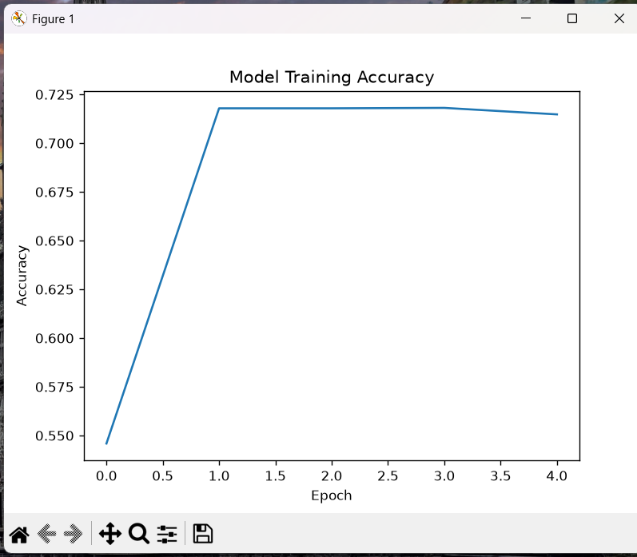
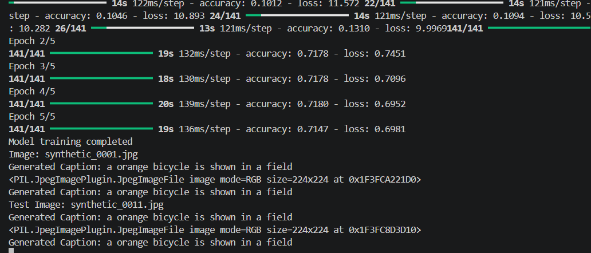

# Image Captioning Using VGG16 and LSTM

## Project Overview

This project is an Image Captioning system that automatically generates a short description for an image.

The project uses **VGG16** for image feature extraction and an **LSTM-based model** for generating captions.

## Technologies Used

- Python
- TensorFlow
- Keras
- VGG16
- LSTM
- Pandas
- NumPy
- Pillow
- Matplotlib

## Dataset

The project uses a synthetic dataset containing:

- 500 images
- 500 image captions

The images and captions are matched and preprocessed before model training.

## Methodology

The main steps of the project are:

1. Dataset extraction
2. Caption loading and cleaning
3. Image preprocessing
4. VGG16 feature extraction
5. Tokenization of captions
6. LSTM model training
7. Caption generation
8. Testing on an image
9. Training accuracy visualization

## Model Training

The model was trained for **5 epochs**.

The final training accuracy was approximately **71%**.

## Sample Output

For the test image, the model generated:

**Generated Caption:**  
`a orange bicycle is shown in a field`

## Training Accuracy

The following graph shows the model training accuracy over 5 epochs.

## Project Output

The terminal output from the project execution is shown below.

## Project Files

- `untitled60_vscode_windows.py` — Main Python source code
- `accuracy_graph.png` — Training accuracy graph
- `training_output.png` — Project execution output

## Conclusion

The Image Captioning project successfully extracts image features using VGG16 and generates captions using an LSTM-based model. The project demonstrates how deep learning can be used to automatically describe images.
